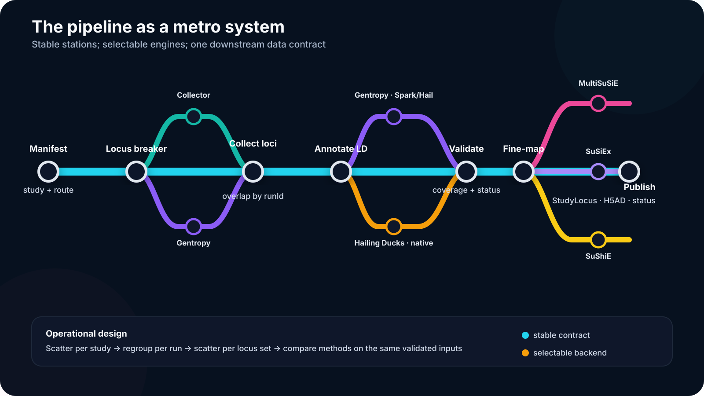
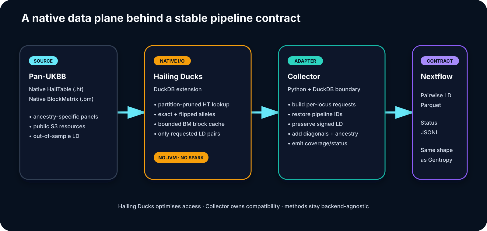
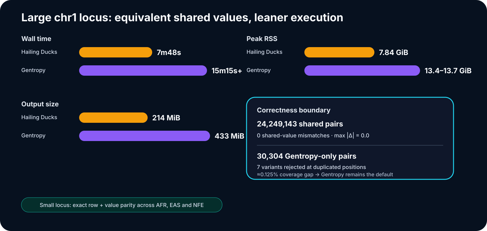
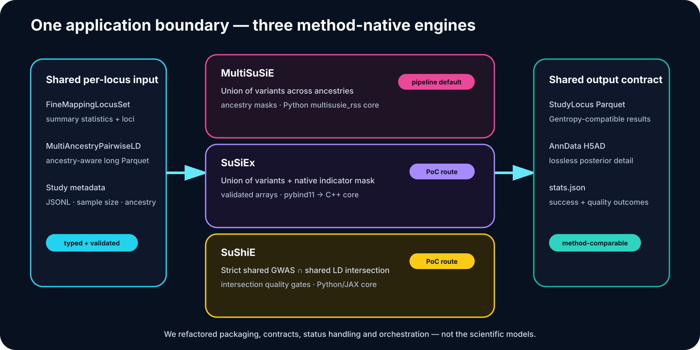

<!-- _class: title -->
<!-- _paginate: false -->

Open Targets · project update · 13 August 2026

# Multi-ancestry fine-mapping at scale

## Pipeline orchestration · native LD access · method application refactors

A reproducible route from GWAS summary statistics to comparable, Gentropy-compatible fine-mapping outputs.

---

# Why this work exists

Today, Open Targets fine-maps studies mostly **one study and one ancestry at a time**. The opportunity is to group studies of the same trait and use population differences in LD to separate causal variants from correlated tags.

  
<b>7,490</b>multi-study trait sets in release 26.06

  
<b>Summary stats</b>no individual-level genotypes required

  
<b>Out-of-sample LD</b>gnomAD and Pan-UKBB references

<strong>What changed:</strong> we now have a scalable Nextflow route that groups studies, constructs cross-study loci, retrieves ancestry-matched LD, and fans the same validated inputs into multiple fine-mapping engines.

Sources: [P1], [P2], [P3]

---

<!-- _class: visual -->

# The pipeline, as a metro map

Sources: [P2], [P3], [P4]

---

# 1 · nf-fine-mapping: the orchestration layer

### Stable stages

- Manifest validation and route selection
- Per-study locus breaking
- Per-`runId` overlap collection
- Per-locus-set LD annotation and validation
- Configurable fine-mapping fan-out
- Gentropy-compatible publication

### Engineering properties

- Typed Nextflow channels preserve metadata
- Task boundaries support scatter, caching and `-resume`
- Collector/Gentropy backends remain comparable
- Quality failures emit status instead of misleading outputs
- Local and Google Cloud profiles share the same contracts

<strong>Current verification:</strong> 23/23 nf-test checks pass; Collector CI is green at commit <code>4d9db06</code>. MultiSuSiE is the default fine-mapping route.

Sources: [P2], [P3], [P5], [P6]

---

# 2 · Hailing Ducks + Collector

Sources: [H1], [H2], [H3], [H4]

---

<!-- _class: visual -->

# Native LD retrieval: measured impact

Benchmark run 29 July 2026 against public Pan-UKBB resources. Source: [H5]

---

# 3 · Refactoring the SuSiE-family applications

Sources: [M1], [M2], [M3], [M4]

---

# Same lifecycle, deliberately different science

| Method | Variant semantics | Native engine | Pipeline maturity |
|---|---|---|---|
| **MultiSuSiE** | Union across ancestries; missingness masks | Python `multisusie_rss` | **Default**, synthetic container fit in CI |
| **SuSiEx** | Union plus explicit native indicator mask | C++ via pybind11 | Packaged **PoC route** |
| **SuShiE** | Strict shared GWAS ∩ shared LD intersection | Python/JAX | Packaged **PoC route** |

The refactor standardises **inputs, validation, CLI/container execution, outputs and status handling**. It does not merge or rewrite the scientific models.

Every method can emit <strong>StudyLocus Parquet</strong> for Gentropy, <strong>AnnData H5AD</strong> for full posterior detail, and <strong>stats.json</strong> for machine-readable quality outcomes.

Sources: [M1]–[M7]

---

# What is ready — and what comes next

### Ready to showcase

- End-to-end typed workflow topology
- Collector locus processing and validation
- Selectable, parity-tested native LD backend
- Shared application contract across three methods
- Green Collector CI and pipeline stub suite

### Promotion work

- Resolve same-position multi-variant coverage in Hailing Ducks
- Run the switched Hailing profile end to end
- Pin released method images in pipeline configuration
- Add real-container pipeline evidence for SuSiEx and SuShiE
- Benchmark methods on the same representative locus sets

<strong>Decision boundary:</strong> Gentropy remains the production LD default; Hailing Ducks is opt-in. MultiSuSiE is the method default; SuSiEx and SuShiE remain PoC pipeline routes until real-container integration evidence is complete.

Sources: [H5], [P3], [P5], [M1], [M8]

---

<!-- _class: references -->

# References · pipeline and LD

- **[P1]** [Project abstract: rationale and release 26.06 scale](../abstract/abstract.qmd)
- **[P2]** [Pipeline overview](../user-guide/overview.rst)
- **[P3]** [Workflow contracts and selectable backends](../user-guide/workflows.rst)
- **[P4]** [Top-level Nextflow workflow](../../main.nf)
- **[P5]** [Execution and verification guide](../user-guide/execution.rst)
- **[P6]** [Green Collector CI after contract-test repair](https://github.com/opentargets/nf-fine-mapping/actions/runs/31699948286)
- **[H1]** [Hailing Ducks overview](https://github.com/project-defiant/hailing-ducks/blob/main/README.md)
- **[H2]** [Batch-optimised LD query design and status contract](https://github.com/project-defiant/hailing-ducks/blob/main/docs/LD-QUERY.md)
- **[H3]** [Collector Hailing Ducks adapter](../../tools/collector/src/collector/hailing_ld.py)
- **[H4]** [Selectable locus-annotation workflow](../../workflows/locus_annotation/main.nf)
- **[H5]** [Hailing Ducks LD benchmark and rollout gates](../benchmarks/hailing-ducks-ld-annotation.rst)
- **[H6]** [Pan-UK Biobank GWAS resource](https://doi.org/10.1038/s41588-025-02335-7)
- **[P7]** [Nextflow](https://doi.org/10.1038/nbt.3820)

---

<!-- _class: references -->

# References · method applications

- **[M1]** [Fine-mapping routes and common I/O contract](../user-guide/fine-mapping-routes.rst)
- **[M2]** [MultiSuSiE Open Targets application fork](https://github.com/project-defiant/MultiSuSiE)
- **[M3]** [SuSiEx Open Targets application fork](https://github.com/project-defiant/susiex)
- **[M4]** [SuShiE Open Targets application fork](https://github.com/project-defiant/sushie)
- **[M5]** Wang et al. [SuSiE](https://doi.org/10.1111/rssb.12388), *JRSS B* (2020)
- **[M6]** Yuan et al. [SuSiEx](https://doi.org/10.1038/s41588-024-01870-z), *Nature Genetics* (2024)
- **[M7]** Lu et al. [SuShiE](https://doi.org/10.1038/s41588-025-02262-7), *Nature Genetics* (2025)
- **[M8]** Rossen et al. [MultiSuSiE](https://doi.org/10.1038/s41588-025-02450-5), *Nature Genetics* (2026)

<strong>Repository state used for this deck:</strong> nf-fine-mapping <code>main@4d9db06</code>; Hailing Ducks <code>v1.1.0</code>; MultiSuSiE <code>v1.0.0</code>; SuSiEx <code>v0.1.0</code>; SuShiE <code>v1.0.0</code>. Status checked 13 August 2026.

