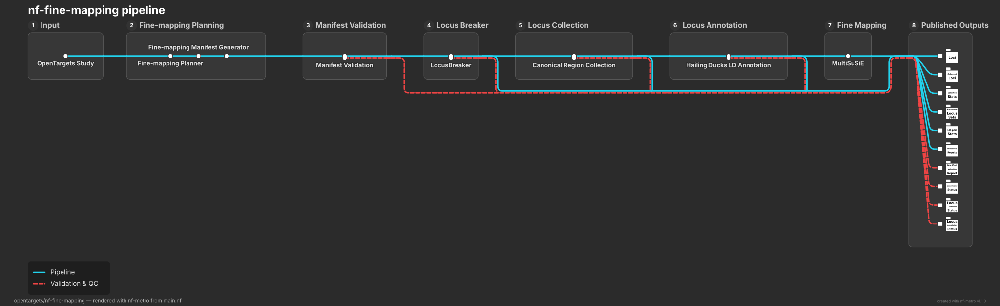

Pipeline overview
=================

IDIC performs summary-statistics fine-mapping using out-of-sample LD. The
workflow is designed for multi-study and multi-ancestry analyses and emits
Gentropy-compatible datasets for downstream Open Targets processing.

The major stages are:

1. Read and filter study metadata from a manifest.
2. Break summary statistics into study loci.
3. Collect overlapping loci across studies in a shared ``runId``.
4. Prepare LD and fine-mapping inputs.
5. Run a configured fine-mapping route, such as MultiSuSiE.

The pipeline can run locally for development or on Google Cloud through the
provided Nextflow profiles.

         locus breaking, locus collection, LD annotation and fine-mapping to
         published outputs.

Regenerate this diagram with ``make docs-metro-map`` after changing
``main.nf`` or its subworkflows; the source lives at
``docs/architecture/pipeline-metro-map.mmd``.

Data resolution
---------------

The workflow operates at summary-statistics resolution. It does not require
individual-level genotypes. LD is supplied through external reference panels,
which makes the workflow suitable for large-scale GWAS Catalog analyses while
introducing the usual out-of-sample LD limitations.
